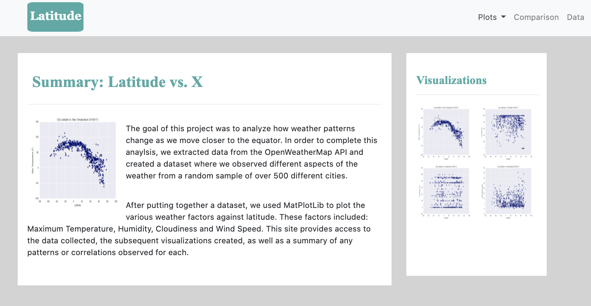

# Web Design: Latitude Analysis Dashboard

## Project Overview

The goal of this project is to use JavaScript, HTML, CSS, and Bootstrap to design a webpage that visualizes the data and analysis from a previous project, the GitHub for which can be found [here](https://github.com/jobrien1726/WeatherPy). 

Data from a random selection of 500+ cities around the globe, varying in proximity to the Earth's equator, was collected using the OpenWeatherMap API. Temperature, Humidity, Cloudiness, and Windiness were all analyzed with regard to Latitude in order to get a closer look at how weather patterns change as one moves closer to the equator. The results of this analysis, including each respective scatter plot, is now available for user friendly exploration: [Latitude Analysis Dashboard](https://jobrien1726.github.io/web-design-challenge/)

## Some Conclusions from this Analysis

1. The cities with the highest maximum temperatures do not seem to fall exactly ON the equator as I would've expected, but rather are located just below and just above the equator. The cities located right at 0 latitude dip a little bit in temperture. 

2. The trend observed here with regard to humidity I also found to be unexpected. I would've guessed that cities along the equator had a higher percentage of humidity, but the scatter plot indicates that cities between 40 and 80 degrees latitude have a much higher percentage of humidity overall. 

3. The scatter plot with regard to Wind Speed indicates that the wind gets stronger as we move further from the equator. This trend does align with what I would've anticipated.

## Technologies Used
- Python
- JavaScript
- Pandas
- HTML
- CSS
- BootStrap
- jQuery
